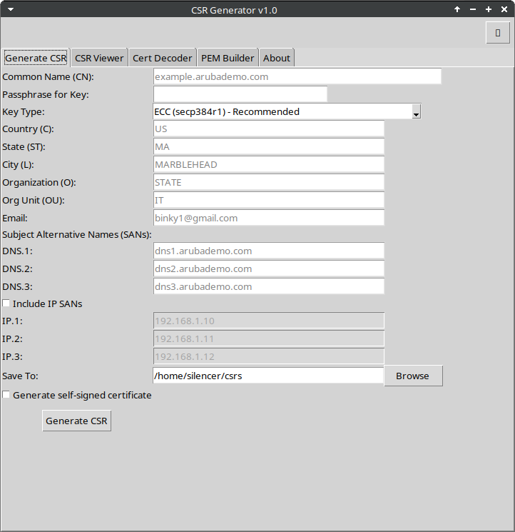
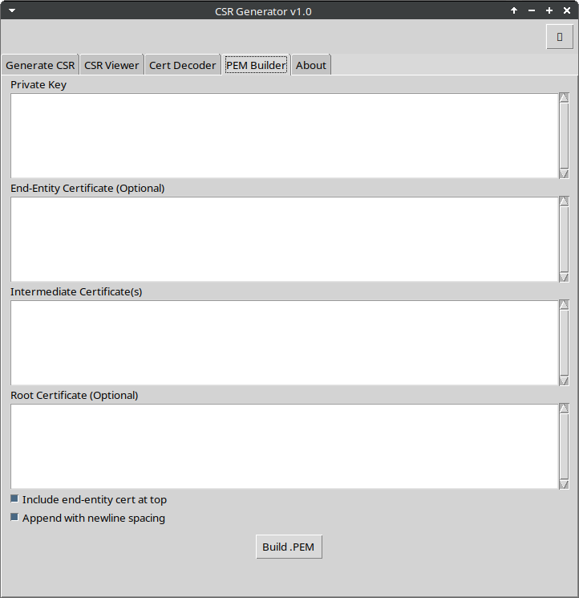

# CSR Generator GUI 🛡️🔐


> Generate CSRs, decode certs, build PEMs — all in a friendly cross-platform GUI.

---

## 🖼️ Preview

### Generate CSR Tab


### PEM Builder Tab


---

## 🚀 Features

- 🔐 **Generate CSRs** with full subject + SAN fields
- 🌙 **Dark mode** toggle
- 🧠 **CSR & Certificate decoder** with OpenSSL output
- 🧱 **PEM bundle builder** with support for intermediate & root chaining
- 🧰 **AppImage & Windows .exe support**
- ✅ Drag-and-drop support (for decoder tabs)
- 🧪 Self-signed cert toggle

---

## 📦 Project Structure

```
csr-generator/
├── csr_generator_gui_full.py       # Main Python GUI script
├── build_exe.bat                   # Windows builder
├── CSRGenerator.desktop            # Linux .desktop launcher
├── AppDir/                         # AppImage structure
├── ghosttrap.ico                   # Placeholder icon
├── screenshots/                    # App screenshots
└── LICENSE                         # MIT License
```

---

## 🔧 Getting Started

### Linux:
```bash
sudo apt install python3 python3-tk openssl
python3 csr_generator_gui_full.py
```

### Windows:
- Double-click `build_exe.bat` to create `CSR_Generator_GUI.exe` using PyInstaller.

### AppImage:
```bash
./appimagetool-x86_64.AppImage CSR-GUI.AppDir
```

---

## 🙌 Contributing

Pull requests welcome! Start by opening an issue or a feature request.  
Contributions, bug reports, and feedback are all appreciated ❤️

---

## 📄 License

MIT © [Mike Binkowski](https://github.com/th3r3isnospoon)
