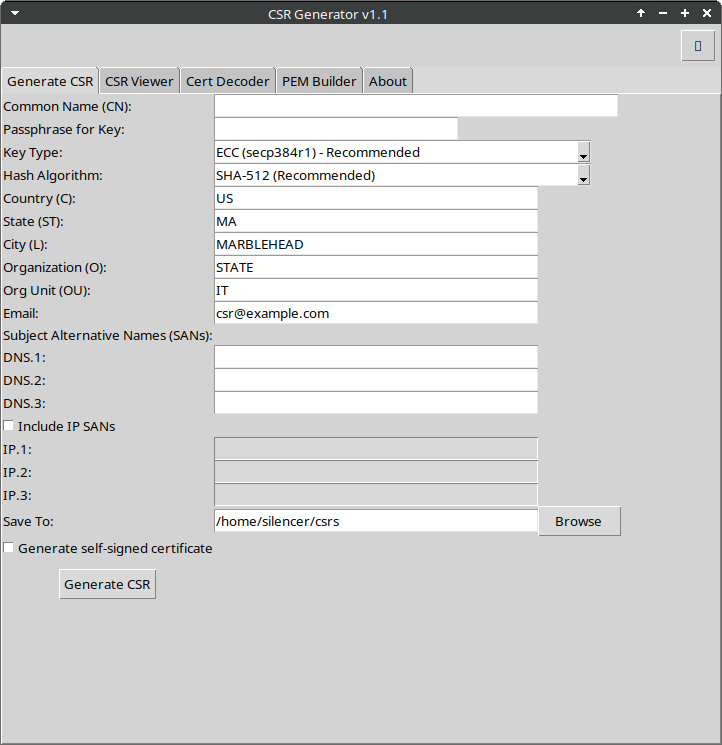
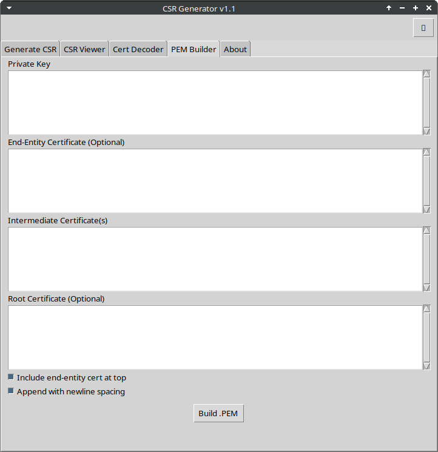

# CSR Generator GUI 🛡️🔐


<p align="center">
  
</p>

---

## 🖼️ Preview (v1.1)

### Generate CSR Tab  


### PEM Builder Tab  


---

## 🚀 Features

- 🔐 **Generate CSRs** with full subject + SAN fields
- 🌙 **Dark mode toggle** (light/dark themes)
- 🧠 **CSR & Certificate decoder** using OpenSSL
- 🧱 **PEM builder** with intermediate + root chaining support
- ✅ **Self-signed certificate option**
- 🧪 **Drag-and-drop** support (planned)
- 🖼️ **Screenshots + AppImage/EXE packaging**

---

## 📦 Project Structure

```
csr-generator/
├── csr_generator_gui_full.py       # Main Python GUI script
├── README.md                       # This file
├── build_exe.bat                   # Windows build script
├── CSRGenerator.desktop            # Linux .desktop launcher
├── AppDir/                         # AppImage directory structure
├── ghosttrap.ico                   # Placeholder icon
├── screenshots/                    # App screenshots & logo
└── LICENSE                         # MIT License
```

---

## 🔧 Getting Started

### Linux:
```bash
sudo apt install python3 python3-tk openssl
python3 csr_generator_gui_full.py
```

### Windows:
1. Install Python 3.6+ and OpenSSL
2. Double-click `build_exe.bat` to package with PyInstaller

### AppImage (Linux portable):
```bash
./appimagetool-x86_64.AppImage CSR-GUI.AppDir
```

---

## 🙌 Contributing

Pull requests are welcome!  
Start by opening an issue or a feature suggestion — contributions, bug reports, and ideas are always appreciated ❤️

---

## 📄 License

MIT © [Mike Binkowski](https://github.com/th3r3isnospoon)
