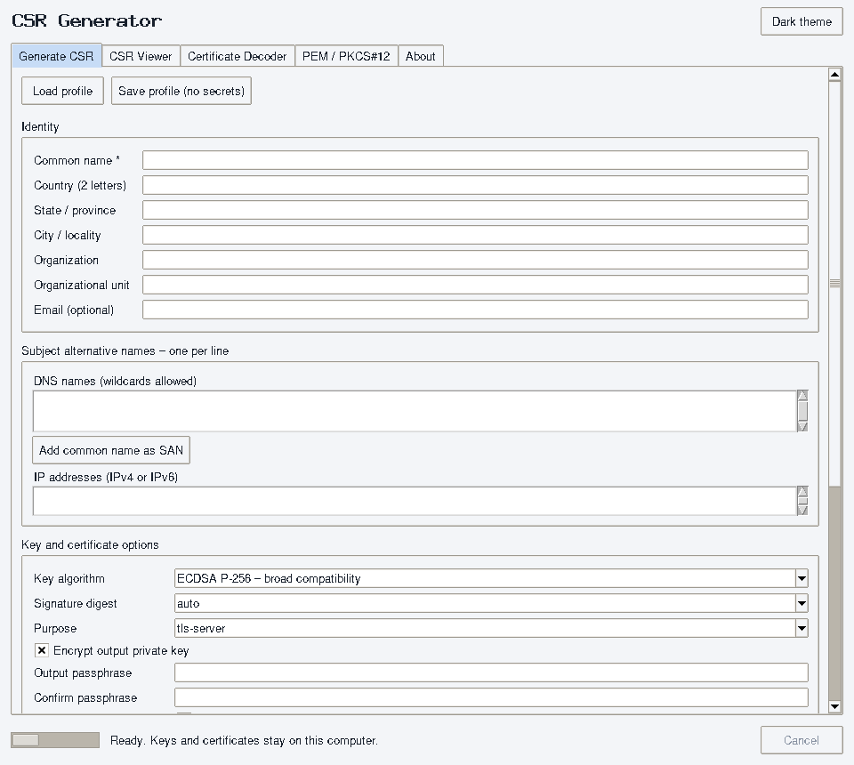

# CSR Generator 2.0

<p align="center">
  
</p>

Generate certificate signing requests, inspect CSRs and certificates, and export
PEM or PKCS#12 bundles through a desktop app or CLI.

Everything runs locally. The application uses no accounts, telemetry, cloud services,
or network access.

## Download

**Windows and Linux users can download a ready-to-run package—no Python installation needed.**

| Platform | Download | Start the app |
| --- | --- | --- |
| Windows x86_64 | [Windows ZIP](https://github.com/th3r3isnospoon/csr-generator/releases/download/v2.0.0/CSR-Generator-2.0.0-Windows-AMD64.zip) | Extract the ZIP and open `csr-generator-gui.exe`. Keep the entire folder, including `_internal`. |
| Linux x86_64 | [AppImage](https://github.com/th3r3isnospoon/csr-generator/releases/download/v2.0.0/CSR-Generator-2.0.0-Linux-x86_64.AppImage) · [ZIP](https://github.com/th3r3isnospoon/csr-generator/releases/download/v2.0.0/CSR-Generator-2.0.0-Linux-x86_64.zip) | Make the AppImage executable and run it, or extract the ZIP and run `./csr-generator-gui` inside its folder. |

See the [release notes and SHA-256 checksums](https://github.com/th3r3isnospoon/csr-generator/releases/tag/v2.0.0)
for verification and compatibility details. Linux previews were tested on Linux;
the unsigned Windows package passed CI smoke tests. Manual Windows desktop testing
and native macOS execution remain unverified.

## Features

- Generate RSA, ECDSA, or Ed25519 keys and CSRs with DNS and IP subject alternative names (SANs).
- Renew using an existing key or create a self-signed certificate.
- Inspect CSRs and certificates, and export PEM chains or encrypted PKCS#12 bundles.
- Use encrypted private keys by default; existing output files are never overwritten.
- Save form profiles without secrets and switch between light and dark themes.



## Basic usage

1. Enter the common name and organization details required by your certificate authority (CA).
2. Add DNS or IP SANs; TLS server requests require at least one.
3. Choose a key algorithm your CA accepts and set a private-key passphrase.
4. Choose an output folder and generate the CSR.

Each request gets its own folder. Submit **`request.csr` to your CA, never
`private-key.pem`**. Keep the private key and its passphrase safe; do not include
secrets in issue reports or screenshots.

## Security

Private keys are encrypted by default, and new outputs use restricted permissions.
This does not protect against a compromised computer or administrator access.
Certificate inspection does not establish trust. See [SECURITY.md](SECURITY.md)
for limitations and vulnerability reporting.

## CLI

The portable ZIP includes `csr-generator` (`csr-generator.exe` on Windows).
From its extracted folder, run `./csr-generator --help` on Linux or
`.\csr-generator.exe --help` in PowerShell. After source installation:

```sh
csr-generator generate --cn example.com --dns example.com --output ./csrs
csr-generator inspect csr ./request.csr
```

Passphrases are prompted, never supplied as command-line arguments.
See the [CLI guide](docs/usage.md#cli) for renewal, profiles, and bundle examples.

## Source installation and documentation

Prefer Python? See [source installation](docs/building.md#install-from-source)
for Python 3.11–3.14 and Tk setup.

- [User guide: CSR generation, inspection, and exports](docs/usage.md)
- [Security and reporting](SECURITY.md)
- [Architecture](docs/architecture.md) · [Building](docs/building.md) · [Testing](docs/testing.md)
- [Changelog](CHANGELOG.md)

## License

[MIT](LICENSE) © Mike Binkowski. Packaged builds include dependency licenses.
