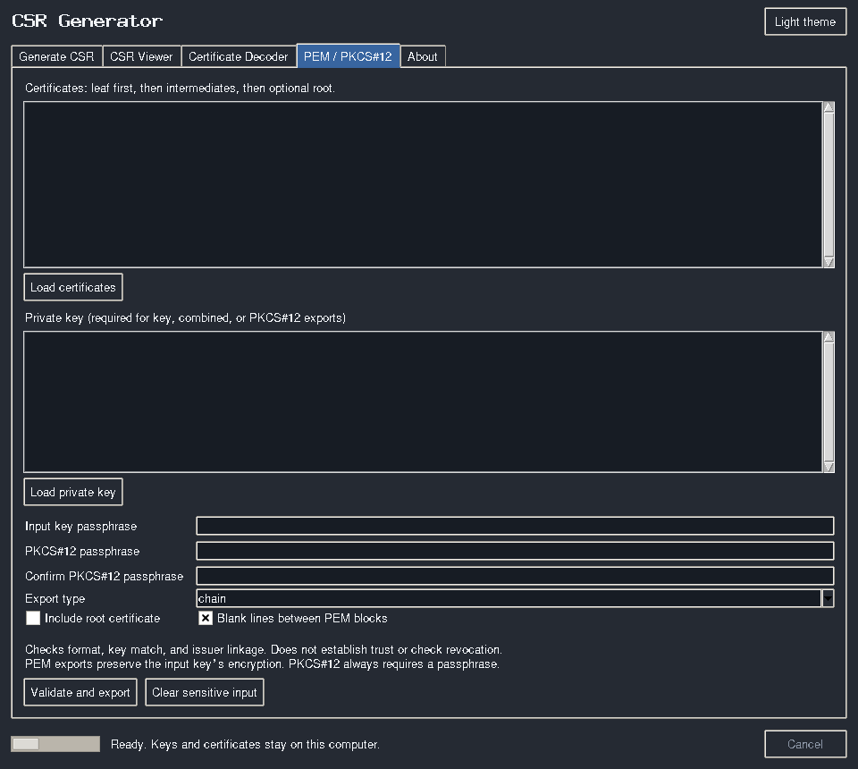

# User guide

[Back to the project overview](../README.md)

## Generate a CSR

1. Enter the common name and any organization fields required by your CA.
2. Add DNS and/or IP SANs. **TLS server** requests require at least one SAN; the
   “Add common name as SAN” button can populate the appropriate list.
3. Choose a key algorithm your CA and consuming application accept. P-256 is the
   default; automatic digest selection uses SHA-256 for RSA/P-256, SHA-384 for
   P-384, SHA-512 for P-521, and no separate digest for Ed25519.
4. Enter and confirm an output passphrase, or explicitly choose an unencrypted key.
   Spaces in passphrases are preserved exactly.
5. Choose an output folder and generate.

Each successful run creates a unique `csr-<UTC time>-<random suffix>/` containing:

- `private-key.pem`: encrypted PKCS#8 by default.
- `request.csr`: submit this to your CA, **not** the private key.
- `certificate.crt`: present only when self-signing is selected.

The common name is never used as a filename. Failed/cancelled operations clean up
staging directories on handled failures. Cancellation waits for a cryptographic step
to finish; it cannot interrupt the library's key-generation call. Once publication
has completed, cancellation does not delete a successful result.

For renewal, choose an existing PEM key and provide its passphrase if encrypted.
The existing key determines the algorithm. The output key is reserialized with the
chosen output encryption; the original file is never modified.

Self-signed certificates are **end-entity certificates, not root CAs**. TLS server
and client profiles set the corresponding extended key usage. Generic mode permits
no SANs and omits extended key usage. Validity is configurable from 1 to 3650 days;
these are local settings, not a promise that a public CA will issue the same certificate.

## Inspect and export

The CSR viewer verifies the CSR's self-signature. The certificate decoder reports
subject, issuer, SAN/extensions, validity, and SHA-256 fingerprints. A valid signature
or a decoded certificate does **not** prove identity or establish trust.

For PEM / PKCS#12 exports, provide certificates in **leaf → intermediates → root** order.
The application rejects malformed input, duplicate certificates, invalid adjacent
issuer signatures, and key/leaf mismatches. It checks issuer CA constraints and
certificate-signing key usage when present. It does not perform full RFC 5280 path
validation, revocation, hostname, policy, or trust-store checks.

Choose:

- **chain**: certificates only; root omitted by default when it is the final self-signed issuer.
- **key**: private key only, preserving input encryption.
- **combined**: certificates followed by the key, preserving input encryption.
- **pkcs12**: an encrypted `.p12` containing the key, leaf, and supplied chain.

A standalone self-signed leaf is retained even when “include root” is off. Root
inclusion and combined-PEM layout depend on the consuming application. Exporting
to an existing filename is refused; choose a new name. Use “Clear sensitive input”
to clear pasted keys and their text-widget undo history.

## CLI

```sh
csr-generator generate --cn example.com --dns example.com --dns www.example.com --output ./csrs
csr-generator generate --cn localhost --dns localhost --ip ::1 --self-signed --output ./csrs
csr-generator inspect csr ./request.csr
csr-generator inspect certificate ./certificate.crt --openssl
csr-generator bundle --certificates ./chain.pem --output ./fullchain.pem
csr-generator bundle --certificates ./chain.pem --key ./key.pem --key-encrypted --mode pkcs12 --output ./server.p12
```

Passphrases are prompted and never accepted as command-line arguments. Use
`--unencrypted` only when an unencrypted output key is intentional. For existing
keys, use `--existing-key` and, if needed, `--existing-key-encrypted`.
`--profile-file profile.json` loads a GUI-saved profile; explicit CLI fields override it.
Run `csr-generator <command> --help` for all options. Errors return a nonzero exit code.

## Additional screenshot



Other v1 screenshots are retained as historical material.
